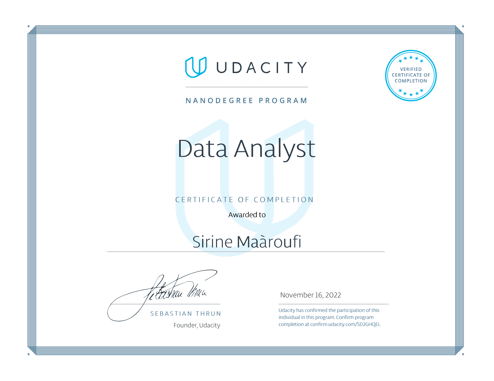

# ALX-T Data Analyst Nanodegree Adventure 🚀

Welcome to the ALX-T Data Analyst Nanodegree repository! 📊📈 

This dynamic 3-month journey, presented in partnership with Udacity, aimed at equipping Africans with a solid knowledge of a Tech Specialization and also accelerating their career progress.

Here, I showcase the projects I completed during the program. Each project reflects my journey and growth as a data analyst. Explore the insights and analyses I've crafted along the way.

Feel free to explore the folders to discover the diverse range of projects I've tackled during this program.

Let's dive into the world of data together!

For details on each project, navigate to their respective folders.

Project 1: Investigate a Dataset
Project 2: Wrangle and Analyse Data
Project 3: Communicate Data Findings

